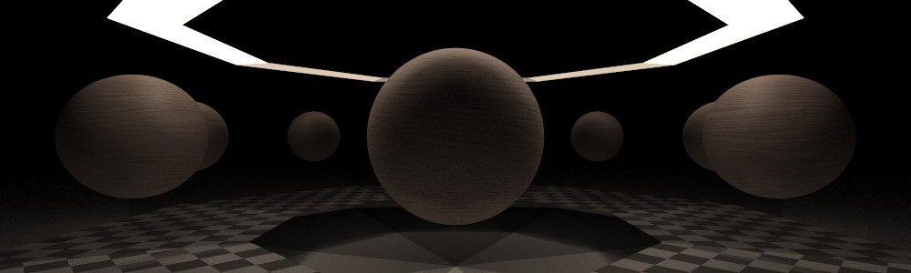
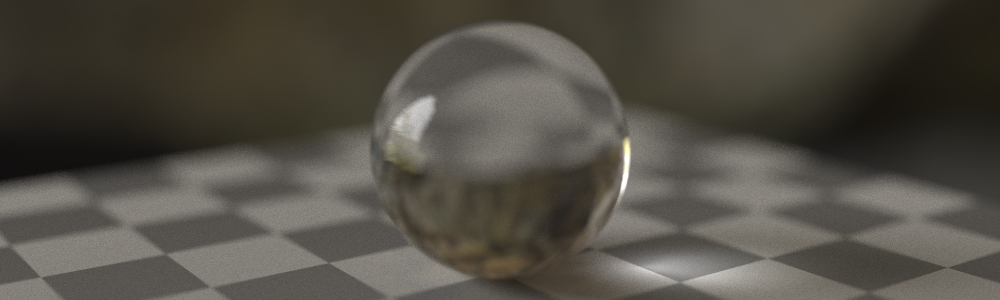
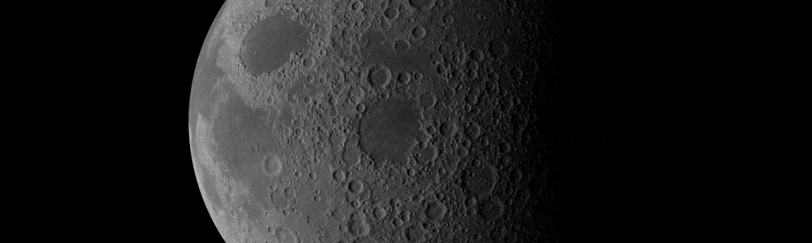
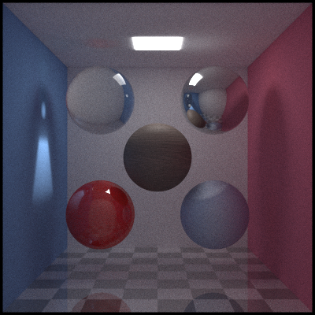

# Red Eye Path Tracer




Multithreaded path tracer with [YAML](https://yaml.org/) scenes description. 
This format is human-readable, which makes it easy to modify and create new scenes. 

## Features
- Multithreading
- Cross platform
- [YAML](https://yaml.org/) scenes description
- Normal mapping
- Bilateral filtering
- Defocus blur
- Reflections and refractions
- Cubemaps and panoramic textures
- Stratification and antialiasing

## How to build
*(In root directory after downloading or copying)*
```
mkdir build
cd build/
cmake ..
```
Build files will be in `build/` folder. 
After that you can use `make` or launch solution in `Visual Studio`. 
Alternatively, you can use cmake `cmake --build .` to build this project.

## Usage
This project should be used as command line application. 
After building you will see executable file `RedEye` that can be launched from terminal. 
If you launch this executable without arguments you will see something like this:
```
=== Red Eye Path Tracer ===

Usage:   ./RedEye <scene-name>
Example: ./RedEye example

Usage:   ./RedEye filter <image-name> <kernel-size> <sigma> <b-sigma>
Example: ./RedEye filter example-scene.png 15 10 0.1

None: default search directories are 'project-root/scenes/' and 'project-root/output/'
(but you can specify absolute path to yaml scene file or image)
Resulting image will be saved in 'project-root/output/'

For more info see README

===========================
```
### Rendering mode
This mode will render [YAML](https://yaml.org/) scene file to png image. 
Default search directory for `.yaml` files is `scenes/` directory inside project's root, 
but you can specify absolute path. 
You don't need to specify `.yaml` extension for file. 
Image will be saved in `output/` directory with name specified inside scene file's output section.
```
./RedEye <scene-name>
```

You can try rendering example scene using this command: 
```
./RedEye example
```

### Filtering mode
This command applies [bilateral filtering](https://en.wikipedia.org/wiki/Bilateral_filter) 
to denoise the specified image. 
Bilateral filtering is a non-linear, edge-preserving smoothing technique that reduces noise 
while preserving sharp edges.
```
./RedEye filter <image-name> <kernel-size> <sigma> <b-sigma>
```
The parameters are:
1) `image-name` - the name of the input image file to be denoised. Image extension must be preserved. 
Default search directory is `output/` inside project's root. Absolute path can be used.
2) `kernel-size` - the size of the kernel (or filter window) used during bilateral filtering. 
This defines the neighborhood around each pixel that will be considered for smoothing. 
Larger values result in stronger smoothing but may also blur finer details.
3) `sigma` - the standard deviation of the Gaussian kernel used for spatial weighting. 
This controls how much influence neighboring pixels have based on their distance from the center pixel. 
A higher value means pixels farther away will contribute more to the smoothing.
4) `b-sigma` - the standard deviation of the Gaussian kernel used for range weighting (intensity difference). 
This controls how much influence neighboring pixels have based on their intensity difference from the center pixel. 
The higher `b-sigma` is, the larger features get smoothened.

Here is an example of denoising example scene's result:
```
./RedEye filter example-scene.png 15 10 0.1
```
> [!TIP]
> These parameters will work pretty poorly for a very noisy image.
> To see better results you can increase the number of samples per pixel to about 3000. 
> Here's what it's gonna look like: 

| Original image | Filtered image |
| -------------- | -------------- | 
| {width=400} | {width=400} |
| `example.yaml` 4k samples, 10 bounces (render time = 318s) | `kernel-size` = 15, `sigma` = 10, `b-sigma` = 0.05 (filter time = 1.5s) |

## Scene description
> [!TIP]
> See [example.yaml](scenes/example.yaml) for full explanation of how to describe scene.

To describe scene you need to specify:
1) parameters of output image 
   - name
   - width
   - height
2) camera settings
   - number of ray samples per pixel
   - number of ray bounces until it is destroyed
   - position of camera
   - position of target (what to look at)
   - field of view [optional]
   - defocus angle (defocus blur strength) [optional]
   - focus distance [optional]
3) objects in scene
4) skybox [optional]

To add objects you need to specify their materials and to create materials you need to specify their textures. 
You can use one texture/material more than once. 
If you describe texture/material and not use it, it will not be parsed. 
Order of blocks inside `.yaml` file doesn't matter.
The simplest scene can be described as follows:

``` yaml
output:
    width: 640
    height: 360
    file name: simple-scene.png


camera:
    samples: 500
    bounces: 10
    position: [3, 3, 3]
    look at: [0.0, 0.0, 0.0]


skybox: [1.0, 1.0, 1.0]


materials:
    main-mat:
        type: plastic
        albedo: [0.0, 0.0, 0.0]


objects:
    sphere:
        type: sphere
        position: [0.0, 0.0, 0.0]
        radius: 1.0
        material: main-mat
```

## Optimization thoughts
Right now this path tracer is incredible inefficient. 
So far the available primitives are spheres and quads. 
There is no support of structures like BVH or KD-trees, which makes rendering models almost impossible. 
Also, scene data such as materials and textures is not cache coherent, 
but I tested method with more cache-uniform data and it gave no more than a 10% speed boost. 
This project is rather a proof of concept to later port these methods to GPU.