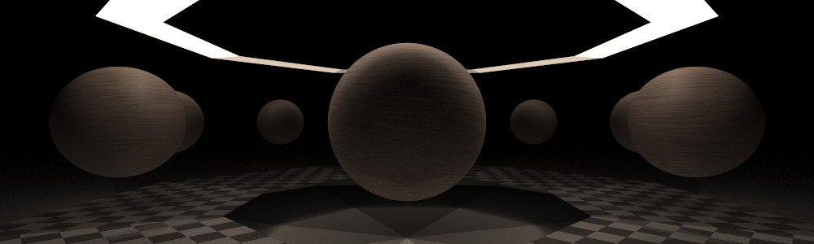

# Simple Path Tracer


This multithreaded ray tracer supports scenes described with [YAML](https://yaml.org/). 
This format is human-readable, which makes it easy to modify and create new scenes 
(more on how to do it below). It should be noted that this tracer is rather inefficient, 
it does not support structures such as BVH or KD-trees, so rendering models will not be a good idea. 
So far the available primitives are spheres and quads.

## Features
- Multithreading
- [YAML](https://yaml.org/) scenes description
- Cross platform
- Lambertian diffuse
- Reflections and refractions
- Stratification and antialiasing

## How to build
*(In root directory after downloading or copying)*
```
mkdir build
cd build/
cmake ..
```
Build files will be in `build/` folder. 
After that you can use `make` or launch solution in `Visual Studio`. 
Alternatively, you can use cmake `cmake --build .` to build this project.